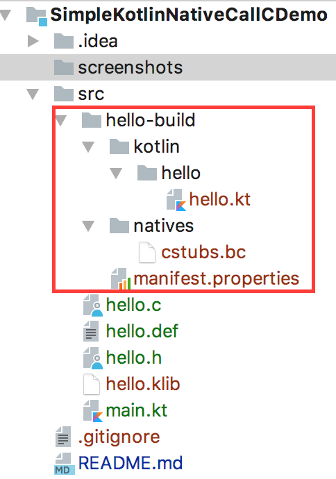
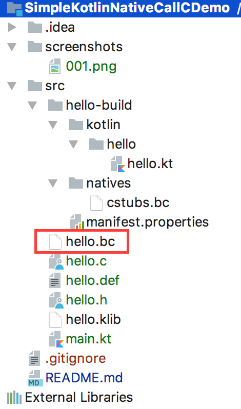
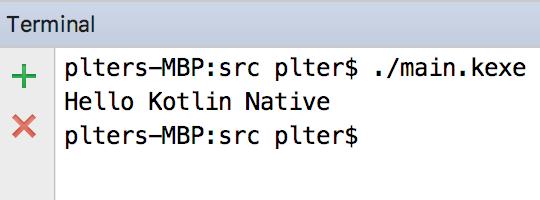

# SimpleKotlinNativeCallCDemo
Kotlin Native 调用C语言的简单示例   


1. 下载并编译Kotlin native [https://github.com/JetBrains/kotlin-native](https://github.com/JetBrains/kotlin-native)
2. 创建hello.h文件，在其中输入如下代码  
    ```c 
    void sayHello();
    ```  
3.  创建hello.c文件，在其中输入如下代码  
    ```c
    #include "hello.h"
    #include <stdio.h>
    
    void sayHello(){
        printf("Hello Kotlin Native\n");
    }
    ```  
4. 创建hello.def文件，在其中输入如下代码  
    ```text
    headers = hello.h
    headerFilter = hello.h
    ```  
    在默认情况下cinterop会分析引入所有的头文件，而此时并无必要，所以配置headerFilter属性为hello.h目的是只分析引入该文件
    
5. 执行如下命令用以分析hello.h文件，并自动生成kotlin定义
    ```shell 
    cinterop -def hello.def -copt -I. -o hello
    ```
    其中-I指的是头文件目录，-o指的是输出名字，该命令执行后将生成目录结构如下图所示
       
6. 执行如下命令用于生成本机库(native library)文件  
    ```shell
    clang -c hello.c -o hello.bc -emit-llvm
    ```
    该命令将生成hello.bc文件，如下图所示  
      
7. 创建main.kt文件，在其中输入如下代码  
    ```kotlin
    import hello.*
    
    fun main(args: Array<String>) {
        sayHello()
    }
    ```  
8. 执行如下命令编译该程序  
    ```shell
    kotlinc main.kt -library hello -nativelibrary hello.bc -o main
    ```
    该代码将生成main.kexe文件  
9. 执行该文件，将会看到输出信息，效果如下图所示
     
    
    